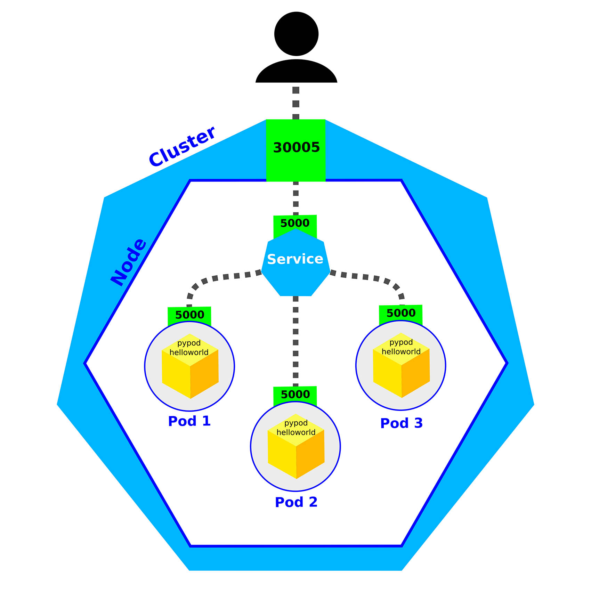

# pypod-helloworld

A simple Flask application that once deployed in a Kubernetes cluster will display the name of each pod.

You will need to port-forward the pod or create a service for the deployment.

To get it from docker hub `docker pull jlessey/pypod-helloworld:v1.0.0`

## example of use

1. Go to your Terminal and clone the repository running `git clone https://github.com/jplessey/pypod-helloworld.git`
2.  `cd` into the `pypod-helloworld` directory.
3. Run `kubectl apply -f python-manifests/deployment.yaml`
This command will use a manifest to create a deployment with 3 replicas and a Nodeport service with port 30005 open.
4. If you are using the Vagrant Box for the SUSE Cloud Native Scholarship program, go to `192.168.50.4:30005`. If you are using minikube, just run `minikube service pypod-helloworld`
5. Refresh the page several times to see how the pod name changes as the NodePort type service works as a load balancing solution.

